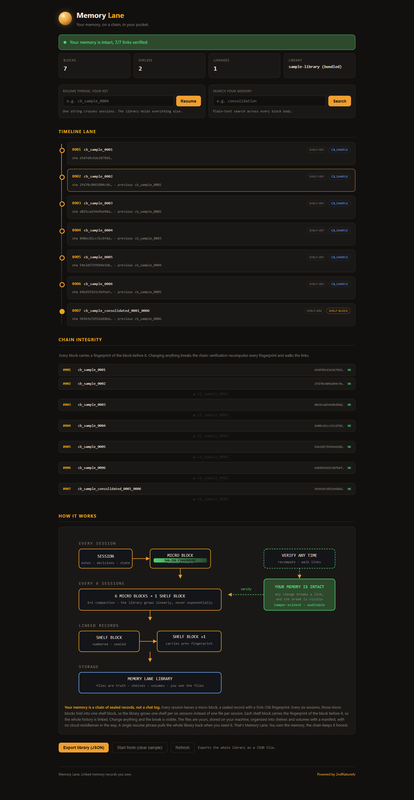

# MAYA Memory Lane

**Your memory, on a chain, in your pocket.**

Memory Lane is a local-first, tamper-evident memory library. Every session leaves a sealed record with a SHA-256 fingerprint, every six records fold into one shelf block, and each shelf block carries the fingerprint of the one before it. The result is a chain of linked records you own, organized into shelves and volumes on your own machine, verified in seconds, and resumed with a single phrase.

**You own the memory. The chain keeps it honest.**

Memory Lane is a web interface over a plain-file library. No cloud, no account, no telemetry. The files are the source of truth and the interface is a window over them. If the interface disappears, the library is still right there on disk.

> **Your memory stays local.** Memory Lane runs entirely on the machine that runs it. Nothing is sent to a cloud service, no account is required, and no data leaves your machine. It is not a hosted service and carries no production SLA.



*Shown with the bundled sample loaded via the "Load sample library" button. A fresh clone opens blank, your lane is empty until you seal records. The sample is fabricated demo data that never touches your machine.*

## What it does

- **Linked memory records**, every session becomes a sealed block with a SHA-256 fingerprint, and every block carries the fingerprint of the block before it. Change anything and the break is visible
- **Automatic ingestion**, drop a transcript into the inbox (or POST it to the API) and Memory Lane extracts durable facts, seals a chain-linked block, and files it, no human step in between
- **6→1 compaction**, six session records fold into one shelf block, so the library grows one shelf per six sessions instead of one file per session
- **Chain verification**, recomputes every fingerprint and walks the links, then tells you plainly what you need to know: intact, unverifiable, or needs attention. The boundary, stated honestly: the manifest is the anchor of trust, so verification catches modification by anyone who cannot rewrite the manifest too. That is integrity detection, not an externally anchored audit log, the chain proves nothing was changed behind your back while you hold the files, it does not prove provenance to a third party
- **Resume phrase as your key**, one string crosses sessions. The library holds everything else
- **Full-text search**, plain-text search across every record body, boosted by extracted facts
- **Ask your memory**, ask a natural-language question and get an answer, exact hits return instantly for free, and when your wording doesn't match, a model reads the retrieved evidence and answers honestly (or says it doesn't know). No invented facts
- **Deterministic export**, a byte-stable JSON bundle of the whole library, one click
- **Zero dependencies**, Node's built-in runtime and test runner, no npm install required
- **Files are truth**, the library is a folder of markdown + JSON manifests. Delete the index, rebuild everything from the chain

## Quick start

Requirements: Node.js 22 or newer.

```bash
npm test
npm start
```

Open `http://127.0.0.1:8766/`.

No dependency installation is required. The package uses Node's built-in runtime and test runner.

**First run is blank on purpose.** A fresh clone shows an empty memory lane, not demo data. Click **Load sample library** in the interface to explore the bundled 7-block demo (fabricated data, clearly labeled), then **Start fresh** to return to empty. Your records never appear in anyone else's clone.

## Pointing at your own library

The server reads whatever library you point it at:

```bash
MEMORY_LANE_LIBRARY=/path/to/your/library node server.mjs
```

A library is a directory containing a `MANIFEST.json` and a `shelves/` tree of block files. The bundled `empty-library/` is the blank default, and `sample-library/` shows the exact format (regenerate it any time with `npm run make-sample`). Any library following that format, with shelves, manifests, fingerprints, and previous-block links, loads straight into the interface.

## How the chain works

Every session ends as a **micro block**, a sealed record with a SHA-256 fingerprint. Every six sessions, those micro blocks are consolidated into one **shelf block**, numbered, timestamped, and chained to the shelf block before it by carrying its fingerprint. Blocks are filed into **shelves** (six per shelf), grouped into **volumes**, and tracked in a **manifest**.

Verification recomputes every fingerprint and walks the links. Three states, deliberately simple:

- **Intact**, every fingerprint matches and every link verifies
- **Unverifiable**, a link exists but no recorded fingerprint exists to compare (neutral, not corruption)
- **Needs attention**, a fingerprint mismatches or a referenced block is missing

That's the whole trust model. You can prove your memory hasn't been altered, and if it has, the break tells you exactly where.

## Automatic ingestion

Memory Lane runs itself. Three surfaces, same chain underneath:

**1. Inbox watcher (drop a file, walk away).** Point the watcher at a folder and it seals everything that lands there:

```bash
python tools/inbox-watch.py --inbox /path/to/inbox --library /path/to/library --once
```

New `.md`, `.txt`, `.json`, or `.log` files are extracted, sealed as chain-linked blocks, and archived to `inbox/processed/<date>/`. Run it on a timer (`npm run watch` loops every 60s, or wire it as a cron job) and the library grows itself. Nothing new in the folder means nothing happens, silent, free.

**2. API (any agent can push a memory).** The server accepts new memories over HTTP:

```bash
curl -X POST http://127.0.0.1:8766/api/ingest \
  -H "Content-Type: application/json" \
  -d '{"text":"A customer leased a 2026 Honda Civic in matte black.","source":"telegram"}'
```

Auto-extraction runs unless you pass explicit `facts` (or `"extract": false`). The response includes the new `lib_id`, `block_id`, and a fresh chain verdict.

**3. CLI (scripts and cron).** Same pipeline from the command line:

```bash
node tools/ingest.mjs transcript.md --source cli
cat notes.txt | node tools/ingest.mjs --title "Evening notes"
```

**How extraction works.** The recommended model is **deepseek v4 flash** through the DeepSeek API (`MEMORY_LANE_API_KEY` / `MEMORY_LANE_BASE_URL` / `MEMORY_LANE_MODEL`), falling back to local Ollama when no key is set. The model turns a raw transcript into a `## Extracted facts` section inside the block, and full-text search indexes those facts so natural-language queries land. Extraction is best-effort by design: if the model is unreachable, the raw text is still sealed and searchable, a memory is never lost to a model hiccup. Re-ingesting identical content is detected and skipped, so watchers and retries never duplicate a block.

## Agents can read it (MCP bridge)

Memory Lane isn't just a UI, it's an **agent memory layer**. A zero-dependency MCP server (`tools/memory-lane-mcp.mjs`) exposes the live library to any MCP-capable agent (Claude Code, Codex, Cursor, Copilot, and others) as callable tools:

| Tool | What it does |
|---|---|
| `ml_search(query)` | Full-text search across all blocks |
| `ml_answer(question)` | Ask a natural-language question, exact match or synthesized from evidence |
| `ml_recent(limit)` | Digest of the most recent blocks (call at session start) |
| `ml_resume(phrase)` | Resolve a resume phrase to blocks |

Register it with any MCP-capable agent:

```bash
<your-agent> mcp add memory-lane --command node \
  --args "tools/memory-lane-mcp.mjs"
```

Once registered, the agent can pull your memory in real time: "what did we decide about the launch?" → `ml_answer` → the answer with the source block. This is the read side that completes the loop, memory collects itself (write side) and answers questions across sessions (read side).

## Benchmarks & independent research

Memory Lane is benchmarked against the closest agent-memory systems, same dataset, same queries, same scoring, each system running its real pipeline. The full writeup lives in [`benchmarks/SIDE_BY_SIDE_REPORT.md`](benchmarks/SIDE_BY_SIDE_REPORT.md), the method in [`benchmarks/BENCHMARK_PROTOCOL.md`](benchmarks/BENCHMARK_PROTOCOL.md), the exact runners in [`benchmarks/harness/`](benchmarks/harness/), the run traces in [`benchmarks/logs/`](benchmarks/logs/), and the aggregated results in [`benchmarks/results/`](benchmarks/results/). Every controlled figure below traces to a committed run log. Nothing is hand-typed into this report, and anyone can rerun the lanes from the committed harness.

**One honest framing note up front:** the controlled table below uses the **oracle** LongMemEval variant, which is the exact-match-friendly lane, FTS5's natural strength and semantic search's weak spot. We publish it because it is the protocol we pre-registered, and we publish the **paraphrase probe** (same questions, different wording) as the companion table below, where FTS5 drops and the semantic lane shows its value. Both tables together are the honest picture; either alone is not.

### Controlled runs, LongMemEval oracle, 500 instances, identical conditions

| Metric | Memory Lane | Honcho | LangMem | Mem0 |
|---|---|---|---|---|
| recall_all@5 | **61.1%** | 40.0% | 72.2% | 68.1% |
| recall_all@10 | **73.2%** | 47.9% | 81.8% | 77.8% |
| ndcg_any@5 | **62.0%** | 28.5% | 35.9% | 33.0% |
| ndcg_any@10 | **65.5%** | 29.5% | 36.8% | 33.9% |

What each system ran (fair-mirror, their real product pipelines, not strawmen):

- **Memory Lane**, deterministic FTS5 (BM25). No LLM, no embeddings, zero cost. This is the honest headline: an exact-match store with no model in the loop out-retrieves a hosted semantic API on the same protocol.
- **Honcho**, hosted semantic API (`peer.search`, raw messages).
- **LangMem**, native extraction (`create_memory_manager`, gpt-4o-mini via DeepSeek) + semantic store search (bge-m3, local Ollama).
- **Mem0**, native pipeline (`add` + `search`, gpt-4o-mini extraction, Chroma local + bge-m3). Note: Chroma disables Mem0's hybrid BM25 lane (semantic-only), a documented product constraint of this configuration.

The honest reading, stated plainly: **LangMem and Mem0 out-retrieve Memory Lane on this protocol** (72.2% and 68.1% vs 61.1% recall@5). Memory Lane beats Honcho outright, holds mid-pack behind the LLM-extraction systems on raw recall, and **leads on rank-aware ndcg@5**, while owning capabilities none of them claim (SHA-256 chain integrity, resume phrases, 6→1 compaction, portability, offline operation, zero recurring cost). We publish our own losses alongside our wins; that is the point of a pre-registered protocol.

**Pipeline asymmetry, stated honestly.** The three pipelines are not identical and we don't pretend they are: LangMem and Mem0 ran their native extraction stage (gpt-4o-mini summarizing transcripts into memory before search), Memory Lane ran raw transcripts with no extraction stage in this lane, and Honcho ran `peer.search` on raw messages without its memory-generation stage. That is "each system's real pipeline" only in the sense that each ran its own product code end to end; it is not a controlled comparison of equivalent preprocessing. We also record that the protocol's own §5.1 notes Honcho's Phase 1 evaluation reported 83% recall/search on its own internal eval, versus 40.0% here on the shared protocol, a spread worth reading carefully before trusting either number in isolation.

### Paraphrase probe, where semantic recall shows its value (companion table)

The oracle lane is FTS5's home turf: the LongMemEval questions contain exact keywords the transcript already holds. Real-world memory questions don't, "the thing about my car GPS in March" rarely matches the stored text verbatim. This probe paraphrases each question (same meaning, different words) and measures whether retrieval still finds the gold session. N=16, Memory Lane only (FTS5 vs FTS5+Vertex embeddings), trace: `benchmarks/logs/paraphrase-probe-*.jsonl`:

| Retrieval lane | recall@5 | Δ |
|---|---|---|
| FTS5 only (zero-dep, offline) | 21.3% |, |
| FTS5 + Vertex embeddings (RRF hybrid) | 31.5% | +10.2 pts |

The honest reading: paraphrase breaks exact-match retrieval hard (21.3%), and the semantic lane recovers a third of what FTS5 missed, on the same hardware, at pennies per query instead of a subscription. This is a small-N single-system probe, not a head-to-head, and we label it as such. The controlled head-to-head on paraphrased queries is on the roadmap; if retrieval quality on natural-language recall matters to you, this is the table to watch.

### Infra-constrained lanes (documented, not hidden)

- **Letta / MemGPT**, adapter written (`harness/run_lane_a_letta.py`), server crashes at startup on Windows (Letta 0.16.8 async-lifecycle bug, config-independent; verified twice with clean homes). Runs when the Windows story or a Linux/Docker lane exists.
- **Zep / Graphiti**, adapter written (`harness/run_lane_a_graphiti.py`), requires Neo4j via Docker (not viable on the test box without resource risk). Runs when Docker/Neo4j is available.

### What we will NOT claim

- ❌ "Memory Lane beats the top 5." We claim measured results vs Honcho, LangMem, and Mem0, plus code-level capability findings for all.
- ❌ "Memory Lane is better than LangMem/Mem0 at retrieval." The controlled runs show otherwise. We report it as measured.
- ❌ Any semantic-recall number for Memory Lane, it has none, and we say so.
- ❌ Any number without a trace, every controlled figure points to a logged run file.
- ❌ Retrieval claims about Letta/Graphiti, not run (infra-constrained); their external numbers are labeled as such.

### Why vendor numbers aren't in the controlled table

Vendor self-reports in this category diverge from independent evals by up to **45 points** (Mem0: 94.4% vendor claim vs 49.0% independent eval). External numbers are kept strictly separate in the report, labeled `[VENDOR]` / `[INDEPENDENT]`, and never mixed into our controlled runs.

### Reproduce it

```bash
git clone https://github.com/MAYA-Platform/MAYA-Memory-Lane
cd MAYA-Memory-Lane/benchmarks
# dataset: huggingface.co/datasets/xiaowu0162/longmemeval-cleaned
# credentials: HONCHO_API_KEY env var for the Honcho lane (see harness/run_lane_a_honcho.py)
python harness/run_all_lanes.py --all             # Memory Lane vs Honcho + Lanes B-E (~30-40 min)
python harness/run_lane_a_langmem.py              # LangMem lane (gpt-4o-mini extraction)
python harness/run_lane_a_mem0.py --clean         # Mem0 lane (then --query-only to re-query)
python harness/generate_sbs_report.py             # regenerates the report from fresh logs
```

Every figure regenerates from the latest run JSONs, and the committed `benchmarks/logs/` + `benchmarks/results/` show the exact runs behind the published tables. On pre-registration, stated honestly: the protocol and the first report entered git in the same commit, so the evidence trail shows the intent and the method but not a timestamped lock before the first run. The protocol is written to constrain scoring and reporting choices regardless; treat it as a method document, not a witnessed preregistration.

## API

| Endpoint | Description |
|---|---|
| `GET /` | The Memory Lane interface |
| `GET /api/status` | Library stats + chain verdict |
| `GET /api/blocks` | Block list (manifest order) |
| `GET /api/blocks/:libId` | One block (frontmatter + body) |
| `GET /api/chain` | Full chain verification walk |
| `GET /api/search?q=` | Search across block bodies |
| `GET /api/answer?q=` | Ask a question, direct / synthesized / none (retrieval confidence gate) |
| `GET /api/resume?phrase=` | Resolve a resume phrase |
| `GET /api/export` | Deterministic JSON export |
| `POST /api/ingest` | Seal a new memory (auto fact extraction) |
| `POST /api/blocks/write` | Seal a new memory with explicit facts (no LLM) |

## Requirements & recommended settings

Memory Lane is deliberately light. The floor and the recommendation are the same machine.

**Minimum:**

- Node.js 22 or newer (the only runtime requirement, no npm install, no database, no GPU)
- Any OS with a filesystem and Node (Windows, macOS, Linux)
- No API key, no cloud account, no telemetry

**Recommended (optional, only for the LLM features):**

- **Auto fact extraction** (`/api/ingest` without explicit facts, or the inbox watcher) runs best with a DeepSeek API key via `MEMORY_LANE_API_KEY` / `MEMORY_LANE_BASE_URL` / `MEMORY_LANE_MODEL`. No key? It falls back to local Ollama, and if neither is reachable the raw text is still sealed and searchable, a memory is never lost to a model hiccup.
- **Ask-your-memory synthesis** (`/api/answer` on paraphrased questions) uses the same model path. Exact-match answers are free and need no model at all.

Everything else, search, chain verification, resume, export, the whole library, is deterministic local code with zero recurring cost. A memory layer that beats a hosted service, running on the competitor floor, offline.

## Repository layout

```text
lib/memoryLaneCore.js        library core: load, verify, search, resume, export, append
lib/extract.js               fact extraction: DeepSeek API (env vars) with Ollama fallback
lib/answer.js                answer gate: direct / synthesized / none (retrieval confidence)
lib/embeddings.js            optional hosted embeddings lane (FTS5 + dense hybrid, opt-in)
lib/observations.js          deterministic auto-observation (zero-LLM signal capture)
lib/injector.js              session-start snapshot injection
public/memory-lane.html      the interface (single file, zero deps)
server.mjs                   zero-dependency HTTP server (read + write + answer endpoints)
empty-library/               the blank first-run library (0 records, default)
tools/ingest.mjs             CLI ingestion: file, --text, or stdin
tools/inbox-watch.py         inbox watcher: auto-seal files in a drop folder
tools/memory-lane-mcp.mjs    MCP server — any agent reads the library in real time
tools/memory-lane-cli.mjs    JSON CLI bridge (used by the Hermes MemoryProvider plugin)
tools/make-sample-library.mjs  deterministic sample library generator
hermes-plugin/               Memory Lane as a first-class Hermes memory provider
sample-library/              the bundled demo library (7 blocks, regenerable)
tests/                       93 tests across core + server + ingest + answer + excerpt
benchmarks/                  pre-registered protocol, side-by-side report, and harness runners (Memory Lane vs Honcho/LangMem/Mem0 + adapters for Letta/Graphiti)
docs/                        specs and design docs (auto-observation spec, etc.)
```

## Support & reporting issues

Found a bug or a sharp edge? Open an issue on this repository. For anything sensitive, use GitHub's **Private vulnerability reporting** (see [SECURITY.md](SECURITY.md)). Never put credentials or private data in a public issue.

If you want your own AI agent to investigate before you report, paste this prompt into your agent:

````text
Investigate a bug report for the MAYA Memory Lane repository. Reproduce
the issue locally if you can, then draft a bug report with: a concise
summary, steps to reproduce, expected behavior, actual behavior, environment
details (OS, Node version), and any relevant logs. Redact all credentials,
API keys, and personal data before showing me the draft. Do not post
anything anywhere without my explicit approval.
````

## License

MIT, see [LICENSE.txt](LICENSE.txt).

---

*Powered by 2ndNatureAi*
